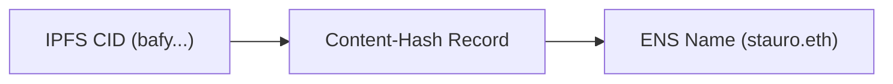

# Get Started

## Installation

Blumen supports one of the these JavaScript runtimes: [Node.js](https://nodejs.org) (20+), [Deno](https://deno.com) (2.2.11+) and [Bun](https://bun.sh).

:::code-group

```bash [npm]
npm i -g blumen
```

```bash [pnpm]
pnpm i -g blumen
```

```bash [bun]
bun i -g blumen
```

```bash [deno]
deno install --global --allow-read --allow-env --allow-write --allow-net npm:blumen
```

:::


## IPFS provider setup

### Initial deployment

The first step is setting up content storage providers to deploy the web application to. The full list is available with detailed instructions on the ["IPFS" page](/docs/ipfs). At the moment of writing, [Storacha](https://storacha.network) is the only provider that allows uploading web content on a free tier, which is why it is used in this guide.

Generating a key for Storacha requires a CLI tool.

Install it with:

:::code-group

```sh [pnpm]
pnpm i -g @storacha/cli
```

```sh [npm]
npm i -g @storacha/cli
```

```sh [bun]
bun i -g @storacha/cli
```

:::

Next, login to your Storacha account:

```bash [Terminal]
storacha login
# ? How do you want to login? Via GitHub
# ? Open the GitHub login URL in your default browser? yes
```

Storacha uses spaces (similar to buckets). You would need to create one, if you don't have one already:

```bash [Terminal]
storacha space create
# ? What would you like to call this space? blumen-docs
# 🔑 You need to save the following secret recovery key somewhere safe! For example write it down on
# a piece of paper and put it inside your favorite book.

# •••• •••••• ••••• ••••• •••••• •••••••• ••••••• ••••••• •••• •••••• •••••• •••• •••••• •••••••
# ••••• •••• ••••••• ••••• •••• ••••• •••••• ••••••• ••••• ••••

# 🔐 Secret recovery key is correct!
# 🏗️ To serve this space we need to set a billing account
# ✨ Billing account is set
# ⛓️ To manage space across devices we need to authorize an account
# ✨ Account is authorized
# 🐔 Space created: did:key:z6Mkw...qAk
```

Save the recovery key in a safe place.

Once you have a space, you need to select it:

```bash [Terminal]
storacha space use <space DID>
```

When both the account and the space are set up, you need to generate a unique private key. It is required to create a delegation proof to be able ot upload files to the space.

```bash [Terminal]
storacha key create
```

Save this private key (which starts with `Mg..`) to an environment variable (`BLUMEN_STORACHA_TOKEN`) in `.env` file.

With the key generated, it is now possible to create a delegation proof:

```bash [Terminal]
storacha delegation create <did_command_above> --can 'store/add' --can 'upload/add' --can 'space/blob/add' --can 'space/index/add' --base64
```

Save the command output in a `BLUMEN_STORACHA_PROOF` environment variable.

In the end your `.env` file should look like this:

```sh [.env]
BLUMEN_STORACHA_TOKEN=Mg123456789ogR1enjgn123bi1KqzYz123456v123iLJkeiLIO4=
BLUMEN_STORACHA_PROOF=mAYIEAJM...uIXm2rXyL...Zxe4Bh6g2RQZwjDUcw3qrvMNXzu2pg/rdd...IGXkvTsk9jnMGkBKPo...A7rC1u/tWHthsGVm8F6...pYJQABcRIgFFoH6R...8ukdZvYKuk2pthEmuyCVkAmPlC/kT3MM
```

Blumen is now ready to deploy your app on IPFS.

Read the environment variables from `.env` file:

```bash [Terminal]
source .env
```

And run `blumen deploy` (will deploy `dist` dir by default):

```bash [Terminal]
blumen deploy
```

```
🟢 Deploying with providers: Storacha
📦 Packing dist (4.43MB)
🟢 Root CID: bafybeig2rerivrgw6y2bbh65hib2fxicmc7te4xygakkln4foocprcppeq
✓ [>>>>>>>>>>>>>>>>>>>>>>>>>>>>>>>>>>>>>>>>>>>>>>>>>>>>] Finished in 12s
✔ Deployed across all providers

Open in a browser:
IPFS:      https://bafybeig2rerivrgw6y2bbh65hib2fxicmc7te4xygakkln4foocprcppeq.ipfs.dweb.link
Providers: https://delegated-ipfs.dev/routing/v1/providers/bafybeig2rerivrgw6y2bbh65hib2fxicmc7te4xygakkln4foocprcppeq
```

### Pin to other providers

Uploading a website to a single IPFS provider doesn't guarantee decentralization or censorship resistance. It is recommended to pin to at least 1-2 more IPFS providers.

Adding more IPFS providers is as easy as adding an API token, for example for [Pinata](https://pinata.cloud) it would be `BLUMEN_PINATA_TOKEN`.

For a full list of supported IPFS providers, refer to the ["IPFS" page](/docs/ipfs).

## ENS Updates

Blumen directly integrates with [ENS](https://ens.domains) (Ethereum Name Service).

Similarly to how DNS is used for websites to not expose raw IP addresses and be more human-friendly, ENS serves the same purpose for content hashes, for example IPFS CIDs.



Automatic ENS updates are as easy as supplying an extra CLI argument during deploy, and adding a name manager's private key to `.env`:

:::danger
Using a private key of the ENS name manager account has immediate security risks. Consider [Safe MFA setup](#mfa-with-safe) instead.
:::
```sh [.env]
BLUMEN_PK=<0xensmanagerprivatekeygoeshere>
```

```bash [Terminal]
blumen deploy --ens blumen.stauro.eth
```

Updating ENS Content-Hash record requires paying a network fee. The fee varies depending on network load.

## Safe integration

Using a private key of the ENS name manager account imposes significant security risks. In case of environment compromise, an attacker is able to update the ENS name to a malicious version.

One of the unique features that Blumen offers is [Safe](https://safe.global) integration. Instead of EOA managing the ENS name, a multi-signature wallet is put in the front. Such approach allows for advancing security for ENS update pipelines, such as multi-factor authorisation with the [Proposer Flow](/docs/how-it-works#proposer) or role-based permissions with [Zodiac Roles]().


Once it finishes getting processed, the ENS Content-Hash record should start pointing to your new deployment. Now the web app should be discoverable through [any ENS gateway](https://docs.ens.domains/dweb/intro/#browser-support--gateways), for example eth.limo.

## Automation with CI/CD

Blumen seamlessly integrates with CI/CD pipelines.

All the previous steps can be automated in one GitHub Actions workflow. The workflow deploys a new version on IPFS every time a commit is pushed to the `main` branch and automatically proposes a transaction to Safe.

```yaml
name: Deploy with Blumen
on:
  push:
    branches: main
jobs:
  deploy:
    runs-on: ubuntu-latest
    steps:
      - uses: actions/checkout@v4
      - uses: oven-sh/setup-bun@v2
      - name: Install Blumen
        run: bun i -g blumen@1.2.1
      - name: Build website
        run: bun i && bun run build
      - name: Deploy the site
        run: blumen deploy .vitepress/dist --strict --ens ${{ vars.BLUMEN_ENS }} --safe ${{ vars.BLUMEN_SAFE }}
        env:
          BLUMEN_PINATA_TOKEN: ${{ secrets.BLUMEN_PINATA_TOKEN }}
          BLUMEN_STORACHA_PROOF: ${{ secrets.BLUMEN_STORACHA_PROOF }}
          BLUMEN_STORACHA_TOKEN: ${{ secrets.BLUMEN_STORACHA_TOKEN }}
          BLUMEN_LIGHTHOUSE_TOKEN: ${{ secrets.BLUMEN_LIGHTHOUSE_TOKEN }}
          BLUMEN_4EVERLAND_TOKEN: ${{ secrets.BLUMEN_4EVERLAND_TOKEN }}
          BLUMEN_PK: ${{ secrets.BLUMEN_PK }}
```

The "[CI/CD](/docs/ci-cd)" page describes integrations with other CI/CD providers, such as GitLab Actions.
