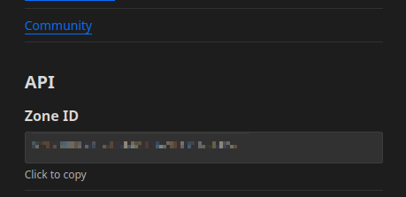

# DNSLink

Blumen supports automatic DNS updates via [DNSLink](https://dnslink.dev). Right now only Cloudflare is supported.

## Setup

### Cloudflare

Obtain Zone ID from the Cloudflare dashboard:



You will also need an API token with permissions for editing Web3 gateways:


Add your Zone ID and API token to environment:

```
BLUMEN_CF_KEY=...-...
BLUMEN_CF_ZONE_ID=...
```