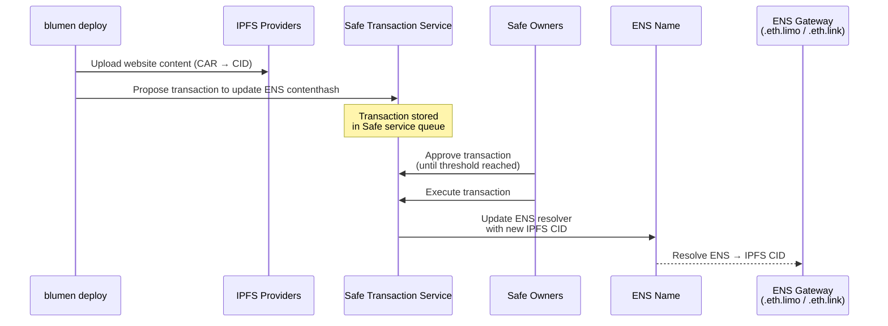
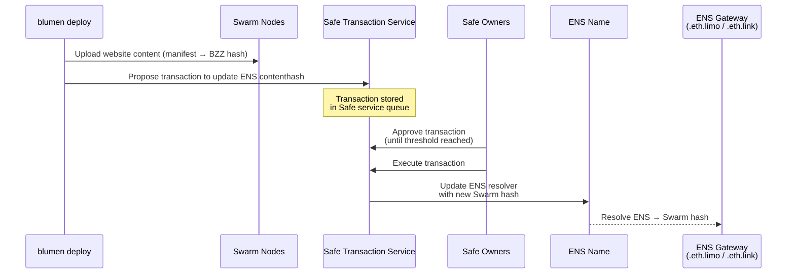

# How it works

Blumen stands out from other decentralized web deployment tools because it adds an extra factor of security to the deployment pipeline by utilizing [Safe](https://safe.global). Instead of relying on a single private key to authorize ENS updates or resorting to slow and insecure options such as IPNS, Blumen proposes a transaction to a Safe multisig via a separate Ethereum account (called "proposer"), while also requiring approval and execution by Safe owners before the ENS website content is updated. This method protects from CI/CD key leaks and access compromise.

Such approach is superior to previous setups, since it does not compromise convenience, decentralization or complexity. The only central factor becomes the Safe transaction service which only serves as a queue for transaction proposals.

## With IPFS

## With Swarm

