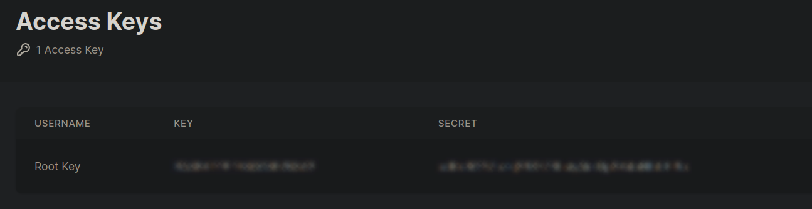

# Supported providers

We support a wide range of different IPFS providers. If you would like to integrate your provider, feel free to submit a pull request.

## Filebase

- URL: https://filebase.com
- API Docs: https://docs.filebase.com/api-documentation/ipfs-pinning-service-api
- API token env variables: `BLUMEN_FILEBASE_TOKEN` for pinning (if not the first provider), additionally `BLUMEN_FILEBASE_BUCKET_NAME` for upload + pin.
- Supported methods: Upload, Pin, Status

`BLUMEN_FILEBASE_TOKEN` for upload + pin is obtained by encoding access key and access secret to base64. Access key and access secret could be found in the Filebase console.



The easiest way to generate an S3 API token is using the `base64` command:

```sh
echo "accessKey:accessSecret" | base64
```

## web3.storage

- URL: https://old.web3.storage
- API Docs: https://old.web3.storage/docs/
- API token env variables: `BLUMEN_W3S_TOKEN`
- Supported methods: Upload, Status

> New UCAN-based web3.storage API integration is in progress

## Gateway3

- URL: https://www.gw3.io
- API Docs: https://doc.gw3.io/api/gateway/pinning.html
- API token env variables: `BLUMEN_GW3_TOKEN`, `BLUMEN_GW3_ACCESS_KEY`
- Supported methods: Upload, Pin, Status

## Lighthouse

- URL: https://lighthouse.storage
- API Docs: https://docs.lighthouse.storage
- API token env variables: `BLUMEN_LIGHTHOUSE_TOKEN`
- Supported methods: Pin
